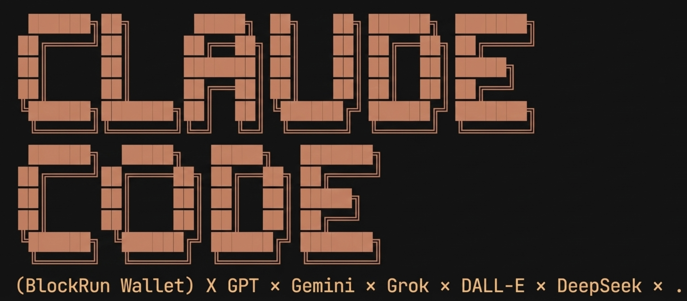

# BlockRun: Give Your AI Agent a Budget, Not API Keys

<div align="center">



[](https://github.com/anthropics/skills)
[](https://antigravity.google)
[](https://blockrun.ai/models)
[](https://blockrun.ai)
[](USDC_ON_BASE.md)
[](https://blockrun.ai)
[](LICENSE)

</div>

**Your agent decides what capabilities it needs. It pays for them autonomously.**

---

## The Idea

What if your AI agent could acquire its own capabilities?

Not "human sets up API keys, agent uses them."
Instead: **"Human gives agent a budget, agent buys what it needs."**

```
Traditional:                          BlockRun:
────────────                          ─────────
Human manages API keys                Agent has its own wallet
Human approves each new capability    Agent decides what to buy
Human reviews usage after             Agent pays autonomously
Control via: key permissions          Control via: wallet balance
```

You fund the wallet with $1-5. Your agent handles the rest.

---

## How It Works

Your agent encounters something it can't do natively:

```
User: "Generate a logo for my startup"
Agent: [Realizes it can't generate images]
Agent: [Has BlockRun wallet with $3 balance]
Agent: [Calls DALL-E, pays $0.04]
Agent: "Here's your logo."
```

No human approval needed. No API key setup. The agent decided it needed image generation and paid for it.

**This is agent autonomy** — the agent acquires capabilities on demand, within a budget you control.

---

## Who Is This For?

| You believe... | BlockRun enables... |
|----------------|---------------------|
| Agents should handle their own capabilities | Agent pays for GPT/Grok/DALL-E autonomously |
| Budgets are better than permissions | Cap spending with wallet balance, not key restrictions |
| Less human-in-the-loop is better | No approval needed for each capability decision |
| Agents should be more autonomous | Agent decides what tools to use, pays for them |

**If you want to manually manage every API key and approve every capability, this isn't for you.**

This is for people building autonomous agents.

---

## Quick Example

```
"blockrun generate a logo"              → Agent pays DALL-E $0.04
"blockrun grok what's trending on X"    → Agent pays for live X data $0.002
"blockrun GPT review this code"         → Agent pays GPT-5 $0.001
"blockrun deepseek summarize 500 files" → Agent pays DeepSeek $0.0001/call
```

Your agent has a USDC balance. When it needs a capability, it pays. You set the budget limit by how much you fund the wallet.

---

## Install

### Step 1: Install the Python SDK

```bash
pip install blockrun-llm
```

### Step 2: Install the Claude Code plugin

**Option A - Plugin Marketplace:**
```
/plugin marketplace add BlockRunAI/blockrun-agent-wallet
/plugin install blockrun
```

**Option B - Git Clone:**
```bash
git clone https://github.com/BlockRunAI/blockrun-agent-wallet ~/.claude/plugins/blockrun
```

### Step 3: Verify

```bash
python3 -c "from blockrun_llm import status; status()"
```

You should see your wallet address and balance. A wallet is auto-created at `~/.blockrun/` on first use.

---

## The Economics

### What $1 Gets You

| Model | Calls per $1 |
|-------|--------------|
| GPT-5 | ~1,000 |
| DeepSeek | ~10,000 |
| Grok (with live X) | ~500 |
| DALL-E images | ~25 |

**$1-5 USDC is enough for weeks of normal use.**

Your wallet balance = your agent's spending cap. When it runs out, the agent stops spending. Simple.

---

## Fund Your Agent

```
1. pip install blockrun-llm
2. First use → Wallet auto-created at ~/.blockrun/
3. Get QR code:
   python -c "from blockrun_llm import open_wallet_qr, get_wallet_address; open_wallet_qr(get_wallet_address())"
4. Scan QR with any wallet app, send $1-5 USDC on Base
5. Your agent now has a budget to spend autonomously
```

**New to crypto?** [USDC Guide](USDC_ON_BASE.md) — 5 minute setup.

---

## Available Models

| Model | Best For | Cost |
|-------|----------|------|
| `openai/gpt-5.2` | Code review, second opinions | $0.001/call |
| `openai/gpt-5-mini` | Cost-optimized tasks | $0.0003/call |
| `xai/grok-3` | **Live X/Twitter data** | $0.002/call |
| `deepseek/deepseek-chat` | Bulk processing (10x cheaper) | $0.0001/call |
| `openai/dall-e-3` | Photorealistic images | $0.04/image |
| `google/nano-banana` | Fast artistic images | $0.01/image |
| `openai/o3` | Complex reasoning | $$$ |
| `google/gemini-2.5-flash` | Long documents (1M+ tokens) | $$ |

30+ models across OpenAI, xAI, Google, DeepSeek, and Anthropic.

---

## Use Cases

### Agent needs image generation
Agent encounters a task requiring images, decides to use DALL-E, pays for it.
```
"blockrun dall-e generate a minimalist logo"
```

### Agent needs real-time data
Agent needs current information, decides Grok has live X access, pays for the query.
```
"blockrun grok what are people saying about AI agents today?"
```

### Agent wants a second opinion
Agent decides another model might catch different bugs, pays for the review.
```
"blockrun GPT review this function for edge cases"
```

### Agent needs to process bulk data cheaply
Agent decides DeepSeek is cost-effective for simple tasks, routes accordingly.
```
"blockrun deepseek summarize each file in /docs"
```

---

## Antigravity Users: Why BlockRun?

Hit Antigravity's limits? BlockRun keeps you working.

| Your Problem | BlockRun Solution |
|--------------|-------------------|
| **Credits ran out after 20 mins** | Your wallet keeps working when Antigravity stops. Route to DeepSeek ($0.0001/call) or GPT while credits refresh. |
| **Stuck in a refactoring loop** | Call GPT or Claude to break the cycle with a fresh perspective. |
| **Gemini missed edge cases** | Get a second opinion from another model before shipping. |

```
# When Antigravity credits are exhausted:
"blockrun deepseek continue refactoring this file"

# When stuck in a loop:
"blockrun GPT review what Gemini just did and suggest a fix"

# When you need a code review:
"blockrun claude check this function for edge cases Gemini might have missed"
```

Your BlockRun wallet doesn't have a 5-hour refresh timer. Fund it once, use it whenever Antigravity can't.

---

## Security

- 🔐 Private key stored locally at `~/.blockrun/`
- ✍️ Only signatures sent to server (key never transmitted)
- 💵 Wallet balance = spending cap (recommend $5-20)
- 🔍 All payments verifiable on [Basescan](https://basescan.org)

---

## FAQ

**"How is this different from API key routers?"**

Most multi-provider solutions are human-managed: you set up API keys, configure permissions, review usage.

BlockRun is agent-managed. You give the agent a budget (wallet balance), the agent decides what to buy, pays autonomously, and stops when the budget runs out.

| Aspect | API Key Approach | BlockRun |
|--------|------------------|----------|
| Who manages access | Human sets up keys | Agent has wallet |
| Control mechanism | Key permissions | Wallet balance cap |
| Capability decisions | Human configures upfront | Agent decides at runtime |
| Mental model | "I gave my agent API access" | "I gave my agent a budget" |

**"But Gemini/GPT can already do X"**

Yes! If your agent's native capabilities are enough, you don't need this. BlockRun is for when your agent encounters something it *can't* do and you want it to solve that problem autonomously.

**"Why crypto/USDC?"**

Micropayments. Your agent paying $0.001 for a single API call doesn't work with traditional payment rails. Crypto enables per-request payments without minimums or monthly commitments.

**"What if my agent spends too much?"**

Your wallet balance is the cap. Fund it with $5, the agent can't spend more than $5. When the balance is low, add more or let it stop. You're in control of the budget, not each individual decision.

**"I ran out of Antigravity credits. Can BlockRun help?"**

Yes. Your BlockRun wallet is independent of Antigravity's credit system. When Antigravity stops, route your next task through BlockRun to keep working. DeepSeek costs $0.0001/call — you can do thousands of calls for pennies while waiting for Antigravity credits to refresh.

**"Antigravity keeps refactoring in circles. What do I do?"**

Call an external model to break the loop. GPT or Claude can review what Gemini did and suggest a different approach. Sometimes a fresh perspective from a different model is all you need.

---

## Alternative: MCP Server

Prefer MCP over Skills? See [@blockrun/mcp](https://github.com/blockrunai/blockrun-mcp).

Same wallet, same models, different interface.

---

## Links

| Resource | URL |
|----------|-----|
| Website | https://blockrun.ai |
| USDC Guide | [USDC_ON_BASE.md](USDC_ON_BASE.md) |
| Buy USDC | https://coinbase.com |
| Bridge to Base | https://bridge.base.org |
| x402 Protocol | https://x402.org |
| Support | care@blockrun.ai |

---

## A Note from the Builder

I built BlockRun because I wanted my agent to be more autonomous.

Every time it needed a capability — image generation, live data, a second opinion — I had to set up another API key, another billing account, another thing to manage.

So I gave it a wallet instead. Now it handles that stuff itself.

Fund the wallet, let the agent work. That's it.

— [@bc1beat](https://x.com/bc1beat) | [@1bcMax](https://github.com/1bcMax) | [care@blockrun.ai](mailto:care@blockrun.ai)

---

## License

MIT
